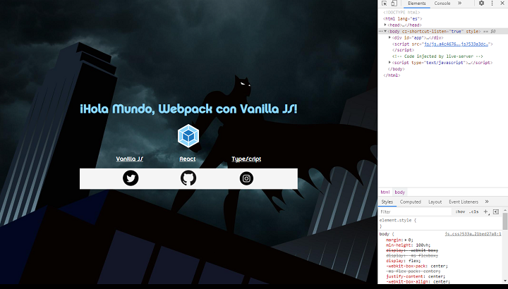

# Webpack

- Proyecto base configurado para _Webpack_ el empaquetador de archivos para aplicaciones _JavaScript_ modernas más popular y usado por los _Frameworks_ y librerías _Frontend_.



---

```javascript
class HelloWorld {
  constructor(name) {
    this.name = name;
  }

saludo() {
    return `¡Hola Mundo, Webpack con ${this.name}!`;
  }
};

//--------------------------------------------------------

  hello = new HelloWorld("Vanilla JS");
  console.log(hello.saludo());
```
>Javascript
```javascript react
export class HelloWorld extends Component {
  render() {
    return (
      <>
        <h1>¡Hola Mundo, Webpack con {this.props.name}!</h1>
        
        <nav className="menu">
          {this.props.menu.map((el) => (
            <a key={el[0]} href={el[1]}>
              {el[0]}
            </a>
          ))}
        </nav>
        {console.log(this.props)}
      </>
    );
  }
}
```
>React

```typescript
export class HelloWorld {
  name: string;

  constructor(name: string) {
    this.name = name;
  }

  greet(): string {
    return `¡Hola Mundo, Webpack con ${this.name}!`;
  }
}
```
>Typescript

---
|   Entry Point     |    Code     |    Output        |
| ------------      | ----------  | ------------     |
|   Index.js        |  Javascript |  js.[hash].js    |
|   Index_ts.js     |  Typescript |  ts.[hash].js    |
|   Index_react.js  |  React      |  react.[hash].js |

---

👏 *Agradecimientos y referencias*: 

- Recursos de Video: 

https://www.youtube.com/watch?v=-bp3q-YTr4Q

>Jonmircha

https://www.youtube.com/watch?v=7e5apiL6tVQ&t=2716s

>Faztcode

https://platzi.com/cursos/webpack/
>Platzi - GNDX

- Códigos de referencia: 

https://webpack.js.org/

https://github.com/jonmircha/youtube-webpack

https://github.com/FaztWeb/markdown-intro

☁️ Mis Redes Sociales:

- 👉 Visita mi sitio web https://manuelmelendez.github.io/ 💻


